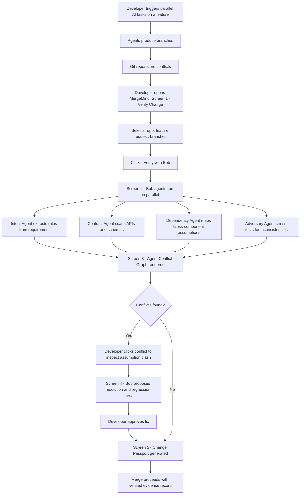

# Idea Analysis: MergeMind

> Status: DRAFT FOR TEAM REVIEW — no implementation has started.

---

## 1. Problem Definition

Modern software teams are adopting parallel AI coding agents — multiple autonomous agents running
simultaneously on different parts of the same codebase. Git's conflict detection operates on text:
it identifies overlapping edits to the same lines. It has no model of intent, business rules, API
contracts, or semantic dependencies.

Two agents can each produce syntactically valid, test-passing code that — when merged — silently
breaks the system because they made incompatible assumptions about shared concepts (e.g. which role
string represents "privileged user"). No tool in the current standard toolchain catches this class
of defect before production.

The problem is real and growing. GitHub's own research and practitioner reports (e.g. from early
Copilot Workspace adopters) already surface "semantic drift" as a concern when multiple AI sessions
touch the same codebase. The shift from one AI assistant to a coordinated multi-agent workflow is
underway at leading engineering teams.

---

## 2. Target Users

**Primary:**
- Software engineers supervising multiple parallel AI coding agents on a single feature or sprint
- Tech leads doing pre-merge review of AI-generated branches
- Teams running IBM Bob (or other AI coding tools) in parallel-task mode

**Secondary:**
- Platform/DevOps engineers embedding verification into CI/CD pipelines
- Engineering managers wanting audit trails and trust signals on AI-generated changes
- Future AI agents themselves — reading Change Passports to understand prior decisions before
  making new ones

What distinguishes the primary user: they are already using AI-assisted development and have
experienced (or fear) the situation where everything compiles and tests pass, yet the behavior is
wrong.

---

## 3. Existing Workflow

Today, verification of semantic consistency across parallel AI-generated changes is entirely manual:

1. Developer reviews each branch's diff in GitHub/GitLab PR UI
2. Developer mentally cross-references changes across branches to check for assumption conflicts
3. Code review comments flag issues — but reviewers must already know what to look for
4. Static analysis tools (ESLint, SonarQube, etc.) check syntax and style, not cross-component
   semantic agreement
5. Tests catch regressions only if a test covering the specific assumption already exists
6. If no test exists, the conflict ships to production

**Shortcomings:**
- Manual cross-branch semantic review is slow (reported: ~27 minutes in the team's own benchmark)
- It requires the reviewer to hold both branches' intent in working memory simultaneously
- There is no structured record of *what assumptions were verified* — only what code was approved
- Existing AI code reviewers (e.g. CodeRabbit, GitHub Copilot PR review) ask "is this code good?"
  — they do not ask "does this change agree with the other changes made in parallel?"

---

## 4. Proposed Solution

MergeMind is a semantic verification layer that sits between AI-generated code changes and the
merge/deploy step. Given a feature requirement and two or more branches of changes, it:

1. Dispatches parallel IBM Bob subagents (Intent, Change, Contract, Dependency, Adversary) to
   independently analyze the requirement and each branch
2. Extracts structured assumptions from each analysis (e.g. "privileged role = owner" vs
   "privileged role = admin")
3. Compares assumptions across branches and against the original requirement to find conflicts
4. Visualizes results in an Agent Conflict Graph (requirement → assumptions → files → dependencies
   → tests)
5. Proposes resolutions and missing regression tests
6. Generates a Change Passport: a permanent, machine-readable record of what was verified, what
   conflicts were found/resolved, and what risk remains

The workflow is: input requirement + branches → Bob analysis → conflict report → resolution →
Change Passport.

---

## 5. User Journey

---

## 6. Core Value

**MergeMind catches the class of defect that Git, tests, and code review all miss: two AI agents
making incompatible assumptions about shared system concepts.**

The single clearest value statement: *before you merge, know that all your agents were describing
the same system.*

---

## 7. Innovation / Differentiation

- **Novel problem framing:** No current tool positions itself as a "semantic consistency layer for
  multi-agent development." This is a new category, not an iteration on existing code review.
- **Adversarial agent design:** Using a dedicated Bob subagent whose explicit job is to find
  inconsistencies — not validate the implementation — is a distinct reasoning pattern.
- **Assumption extraction as a first-class artifact:** Rather than producing a pass/fail, MergeMind
  surfaces the structured assumptions that underlie each change. This makes the invisible visible.
- **Change Passport:** A machine-readable trust record that future AI agents can consume — not just
  a report for humans. This is forward-looking infrastructure, not just a reviewer.
- **IBM Bob as the reasoning engine inside the product:** Bob is not just the tool used to build
  MergeMind — it is the runtime. This directly demonstrates Bob's parallel-task and subagent
  capabilities, which is a meaningful differentiator for the hackathon context.

---

## 8. Existing or Similar Solutions

| Tool | What it does | How MergeMind differs |
|---|---|---|
| **GitHub Copilot PR Review** | AI summarizes and reviews a single PR for code quality | Reviews one branch; does not cross-reference parallel branches or extract assumptions |
| **CodeRabbit** | AI code review on PRs, finds bugs and style issues | Same single-branch scope; no semantic cross-branch comparison |
| **SonarQube / Semgrep** | Static analysis: bugs, vulnerabilities, code smells | Rule-based, not semantic; does not understand developer intent or requirement alignment |
| **Graphite / Trunk** | Stacked PRs, merge queues, CI orchestration | Merge logistics, not semantic verification |
| **Devin / SWE-agent** | Autonomous agent that writes and tests code | Code generation, not post-generation semantic verification |
| **Linear / Jira** | Requirement tracking | No code analysis |

*Sources consulted: GitHub Copilot docs (docs.github.com/copilot), CodeRabbit docs (coderabbit.ai), SonarQube docs (docs.sonarsource.com), Graphite docs (graphite.dev). No tool found that performs cross-branch semantic assumption comparison.*

**Conclusion:** The specific combination of parallel-branch semantic diffing + assumption extraction + Agent Conflict Graph + Change Passport is not available in any current product reviewed.

---

## 9. Technical Feasibility

**What is realistically buildable in 48 hours:**
- A single polished workflow covering the killer example (authentication vs. billing role conflict)
- 5 screens: Verify Change input → agent progress → Conflict Graph → resolution → Change Passport
- Bob subagents for Intent, Contract, Dependency, and Adversary analysis running on a prepared
  demo repository
- Static or semi-static demo data is acceptable for the hackathon; full dynamic analysis of
  arbitrary repos is a future concern

**Key technical unknowns:**
1. **Assumption extraction reliability:** LLM-based assumption extraction from code diffs is not
   deterministic. The same diff may yield different structured assumptions across runs. For a live
   demo, this is manageable with a controlled repo; for production, this is a hard research problem.
2. **Bob parallel task orchestration:** The proposed architecture requires launching multiple Bob
   subagents simultaneously and collecting their structured outputs. This requires the Bob parallel
   tasks API to support structured output schemas — confirm this is available before building.
3. **Conflict Graph rendering:** A graph visualization library (e.g. D3.js, Cytoscape, or React
   Flow) needs to be selected and integrated. Scope is manageable for 48 hours with a simple layout.
4. **Repository ingestion:** Reading real Git diffs and routing relevant files to the right agents
   requires either a GitHub API integration or local Git tooling. Scope for hackathon: accept pasted
   diffs or point to a local repo.

**Rough complexity signal:** The demo-quality version (controlled repo, happy-path flow) is feasible
in 48 hours for a team of 3–4. A production-quality version that handles arbitrary repos and
adversarial inputs is a multi-month engineering effort.

---

## 10. Relevant Bob Capabilities

- **Subagents / parallel tasks:** Core to the architecture — Bob runs Intent, Contract, Dependency,
  and Adversary agents simultaneously; this directly showcases Bob's parallel reasoning capability
- **Document understanding:** Bob reads PRDs, READMEs, ADRs, API specs, and existing code to
  extract structured intent — relevant for the Intent Agent and Change Agent
- **Code analysis and diff reading:** Bob can read code changes and reason about behavioral
  implications — relevant for Contract and Dependency agents
- **Test generation:** Bob can propose missing regression tests once a conflict is identified —
  directly used in the Resolution screen
- **Structured output:** Bob can produce JSON-structured assumption records that MergeMind's
  conflict-comparison logic consumes — critical for the assumption extraction step

---

## 11. Possible Agents, Tools, MCPs, and Other Skills

- **`create-plan` skill:** Useful when moving from this analysis into implementation planning
- **`idea-analysis` skill (this one):** Could be used to analyze sub-features (e.g. the Change
  Passport persistence layer) before building them
- **GitHub MCP:** For real repository integration — reading branches, diffs, and PR metadata
- **A future `semantic-diff` MCP:** A specialized tool that computes structured assumption diffs
  between two code snapshots could make assumption extraction more reliable
- **Graph visualization library as an MCP tool:** If the conflict graph needs server-side rendering,
  a tool MCP wrapping D3 or Graphite render would be useful

---

## 12. Assumptions

The following have not been confirmed by the team or by external research:

1. Bob's parallel task API can launch 4+ subagents simultaneously with structured output schemas
   in the current hackathon environment
2. The demo repository (auth + billing role conflict) will be prepared in advance and available
   before the 48-hour clock starts
3. The "27 minutes manual → 3:40 MergeMind" benchmark is achievable and reproducible on the demo
   repo, not just projected
4. The team has enough frontend capacity to build 5 polished screens in 48 hours alongside the
   Bob integration work
5. LLM-based assumption extraction will be consistent enough across the 4 agents to produce
   non-contradictory structured output in the demo scenario
6. Judges will be familiar enough with the multi-agent development context to understand why
   Git's "no conflicts" result is insufficient — without requiring a lengthy explanation

---

## 13. Risks and Weaknesses

**Technical risks:**
- **Assumption extraction is non-deterministic.** LLMs don't reliably produce identical structured
  assumptions from the same code across runs. In a live demo, a flaky extraction could produce a
  false negative (no conflict detected) or a hallucinated conflict. Mitigation: use a controlled
  repo with deterministic-enough prompting, or pre-cache agent outputs for the demo.
- **Bob API surface for parallel tasks may be more constrained than assumed.** If structured output
  or true parallelism isn't available in the current Bob API, the architecture needs to change.
- **48 hours is tight for 5 screens + Bob integration + conflict graph rendering.** Any scope creep
  or API surprise could leave the demo incomplete.

**Product risks:**
- **False positives erode trust immediately.** If MergeMind reports a semantic conflict that isn't
  real, developers will stop trusting it. The adversary agent needs careful prompt design to
  distinguish genuine inconsistencies from style/naming differences that don't affect behavior.
- **The value proposition depends on multi-agent workflows being common.** Today, most developers
  still use one AI assistant at a time. MergeMind is ahead of the mainstream adoption curve — which
  is a strength for the hackathon narrative but a real GTM challenge for a real product.
- **Change Passport persistence requires storage infrastructure.** For the demo it can be a
  generated document; for production, it needs a database and an access model.

**Positioning risk:**
- The "not a code reviewer" framing is correct but requires extra explanation. Judges may
  instinctively categorize MergeMind as "another AI code review tool" and miss the semantic
  consistency angle. The demo script must close this gap in the first 20 seconds.

---

## 14. Missing Information

1. **Bob parallel task API specification:** Exact capabilities, output schemas, and rate limits for
   running multiple subagents simultaneously — needed before architecture is locked.
2. **Demo repository:** Has the controlled auth/billing conflict repo been built? Who owns it?
   What language/stack?
3. **Team composition and roles:** How many people, and who covers frontend vs. Bob integration
   vs. demo scripting?
4. **Benchmark methodology:** How was the "27 minutes manual" figure derived? Is it reproducible
   on demand for judges?
5. **Hackathon submission requirements:** Does the submission require a deployed live URL, a
   recorded demo, or a live demo? This affects build priorities.

---

## 15. Open Questions for the Team

1. Has anyone verified that Bob's current API supports launching 4+ subagents in parallel with
   structured JSON output? What is the confirmed API surface?
2. Is the demo repository (the auth/billing conflict scenario) already built and committed, or
   does that need to be created as part of the 48 hours?
3. What is the fallback if assumption extraction produces inconsistent results mid-demo? Is there
   a caching/replay strategy?
4. Who owns the frontend build, and is the 5-screen scope realistic given the team's frontend
   capacity in 48 hours? Should one screen be cut?
5. What does the hackathon scoring rubric emphasize — technical depth, demo quality, business
   story, or Bob API usage? The answer should influence where effort goes.
6. Is the Change Passport a generated Markdown file, a UI screen, or both? This affects both the
   frontend scope and the "machine-readable for future agents" claim.

---

## 16. Possible MVP Scope (candidate, not committed)

- One controlled demo repository with a pre-built auth/billing role conflict
- Screen 1: repository + feature request + branch selector input form
- Screen 2: live agent progress display (Intent, Contract, Dependency, Adversary)
- Screen 3: Agent Conflict Graph showing the role assumption clash with affected files
- Screen 4: Bob-proposed resolution (update billing to use "owner") + one generated regression test
- Screen 5: Change Passport as a structured summary document
- Benchmark display: manual review time vs. MergeMind time on the demo scenario
- Three conflict classes detectable in the demo: business-rule, contract, dependency (even if only
  business-rule is shown in the main demo flow)

---

## 17. What Should NOT Be Implemented Yet

- **Arbitrary repository support:** Ingesting and analyzing any GitHub repo dynamically is a
  production feature, not a hackathon feature. The demo uses one controlled repo.
- **Change Passport persistence / database:** A real storage layer for Change Passports adds
  infrastructure complexity with no demo value. Generate as a document, show in UI.
- **Multi-agent orchestration for agents other than Bob:** The "future vision" of working across
  Codex, Cursor, Copilot, etc. is a roadmap item. Do not build or imply cross-agent support in
  the MVP.
- **CI/CD pipeline integration:** Embedding MergeMind as a GitHub Action or CI step is valuable
  post-hackathon, not during it.
- **User accounts, authentication, or multi-tenancy:** Not relevant for a hackathon demo.
- **Webhook retry / advanced async patterns:** The demo runs synchronously; async job queuing is
  out of scope.
- **Production-grade prompt hardening:** The adversary agent and assumption extractor need
  significant prompt engineering for production reliability. For the demo, controlled inputs make
  this a non-issue.

---

**Recommended Next Step:** Confirm Bob's parallel subagent API capabilities (open question #1) and verify the demo repository exists (open question #2), then move to implementation planning.
